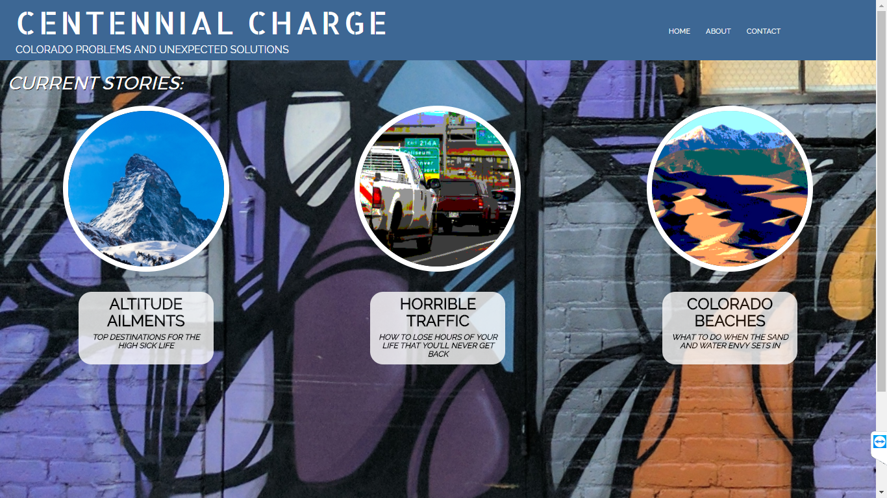
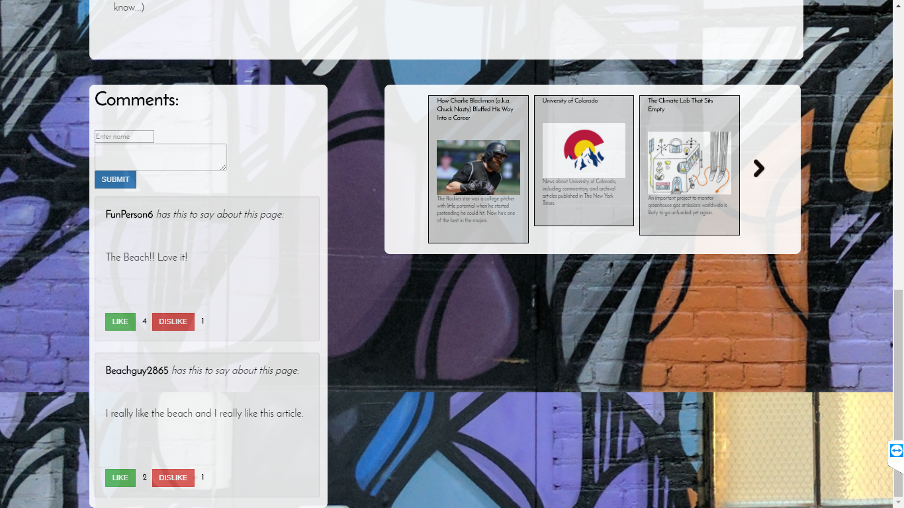

Visit Application: https://901david.github.io/centennialCharge/

# Centennial Charge

This  was a group project I contributed to, whose general idea was to create an ironic Colorado website where ironic created articles would lead users to find genuine Colorado Solutions. For instance if you wanted to get altitude sickness you could visit one of the locations we mapped out using the Google Maps API, and if you genuinely had altitude sickness, you could visit the links below the psuedo articles to find locations for actual oxygen bars.  If you wanted to find beaches you could not find in Colorado visit that link, and also find some "Colorado Beaches" you could visit as well.  Lastly, if you are infuriated by Denver traffic, as most people are, you can visit that article to find out how traffic looks currently in Denver, and some link to also find out how to beat Denver traffic in some of its worst spots.

## My Contributions to the Project

My contributions to the project were mainly on the back-end with a small portion of front-end work. I was responsible for the following aspects.
* Back-End:
Setting up the NY Times API using Ajax calls.  We wanted a small area under our psuedo articles that would use the NY Times API to search for articles that could be displayed that were real articles relating to Denver and the surrounding area. I accomplished this by creating an array of random search terms relating to our subject. As the user loads the page a random term is selected and an Ajax call is made to Ny Times API which results in us receiving articles related to that serach term.  
I also was responsible for the Firebase code associated with the comments section.  I wanted users to be able to comment on the psuedo articles, but to even take it a step further I wanted some sort of indirect user interaction as well, to make this more like a social media site. I added in dislike and like buttons.  These two numbers are generated into "score" of sorts and the comments are actually listed on the page in that order.  If more users are really liking someone's comment it will make its way to the top.  This allows an extra layer of interactivity for the users.
I was also responsible for adding in the back-end portion of our contact page.  I added in some user validation to ensure the fields were being appropriately filled out.  In this instance, we set it up so that when we are contacted by users, it is simply logged in our Firebase database.  

* Front-End
I was responsible for creating all elements relating to my firebase comments and my NY Times articles. The comments section was organized using Javascript and then put int he correct location using JQuery.  For the Ny Times articles, I created a user interface that allowed the users to cycle through a number of articles to see what might interest them.  On both of these portions I utilized Animate CSS as well to accomplish the final look.
I was also responsible once the project was done to go back through and ensure that everything was responsive. I used Bootstrap and media queries to accomplish this.

Technologies Used:
* Javascript
* JQuery
* Ajax
* Firebase
* HTML
* CSS
* Animate CSS
* Bootstrap

